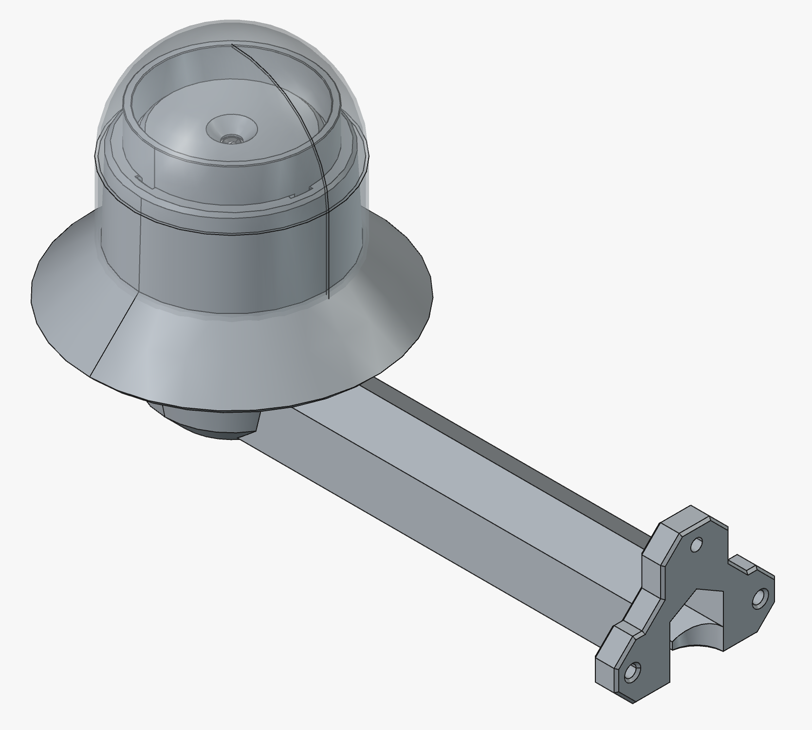

# RealtaSkyCam

Project that will enable people to build an all sky camera for checking sky quality or just recording the stars using "off the shelf" components and open source freely available software. Quotes are being used here as some of the hardware is open hardware and not always available in all markets!

The hardware design has been finalised and now we are on to the software build. 

The software is expected to be run on a raspberry pi and we are reviewing what API/framework to use, no biases other than it should work well on a Pi 3. 
